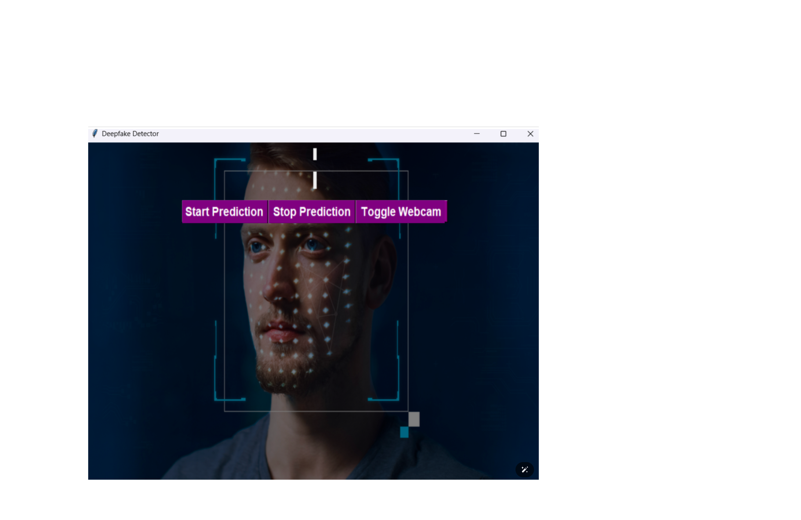

# REAL-TIME-DEEPFAKE-DETECTION-FOR-ONLINE-MEDIA-INTEGRITY




This project involves the development and implementation of a deep learning algorithm that leverages a CNN-RNN approach to detect deepfake videos. This solution is designed to work across various online platforms.

## Table of Contents

- [Introduction](#introduction)
- [Features](#features)
- [Technologies Used](#technologies-used)
- [Installation](#installation)
- [Results](#results)
- [Model](#model)
- [Dataset](#dataset)
- [Contributing](#contributing)
- [Contact](#contact)


## Introduction

Deepfake technology has made it increasingly difficult to distinguish between real and manipulated media. This project aims to address this challenge by developing a robust deep learning model that can accurately identify deepfake videos. By utilizing a combination of Convolutional Neural Networks (CNNs) and Recurrent Neural Networks (RNNs), the model achieves high accuracy and low loss in detecting manipulated media.

## Features

- **High Accuracy:** Achieved an accuracy of 86% in detecting deepfake videos.
- **Low Loss:** Model achieved a loss of 0.19, indicating robust performance.
- **CNN-RNN Approach:** Utilizes the strengths of both CNNs and RNNs for feature extraction and temporal analysis.

## Technologies Used

- **Python:** Main programming language.
- **TensorFlow/Keras:** Deep learning framework for building and training the model.
- **OpenCV:** For video processing.
- **NumPy:** For numerical computations.
- **Pandas:** For data manipulation and analysis.
- **Tkinter:** For creating the graphical user interface.


## Installation
**1.** Clone git repo

```shell
$ git clone "https://github.com/PRADULOP/REAL-TIME-DEEPFAKE-DETECTION-FOR-ONLINE-MEDIA-INTEGRITY.git"
```

**2.** Create virtual env

```shell
$ pip install virtualenv
```
```shell
$  python -m venv env
```
```shell
$  ./env/Scripts/activate
```
**3.** Import Modules

```shell
$ pip install keras
```
```shell
$ pip install pillow
```
```shell
$ pip install numpy
```
```shell
$ pip install tensorflow
```
```shell
$ pip install opencv-python     
```
```shell
$ pip install tkinter     
```
```shell
$ pip install cv2    
```
**4.** Execute prediction model
```shell
$ python ./main.py
```
## Results

The model achieved the following performance metrics:

- **Accuracy:** 86%
- **Loss:** 0.19

These results demonstrate the model's robust performance in identifying deepfake videos.
## Model
Model Download Link:
         https://drive.google.com/file/d/1ibOHcW0NQxFlDT_ghPf9HGKqZ6o0Lq6f/view?usp=sharing
## Dataset
This model was trained using an aggregated dataset consisting of:

- **[Celeb-DF](https://github.com/yuezunli/celeb-deepfakeforensics):** A large-scale deepfake dataset containing celebrity videos.
- **[DFDC](https://ai.facebook.com/datasets/dfdc):** Deepfake Detection Challenge dataset provided by Facebook.
- **[FaceForensics++](https://github.com/ondyari/FaceForensics):** A dataset of manipulated videos for deepfake detection.


Aggregated Dataset Download Link:
https://drive.google.com/drive/folders/1umdXB_4gLBHH6LoEyi5X7E9rwm6on1YQ

## Contributing

Contributions are welcome! Please feel free to submit a Pull Request or open an Issue to discuss potential changes.

## Contact

For any questions or inquiries, please contact me at pradul2002@gmail.com.


